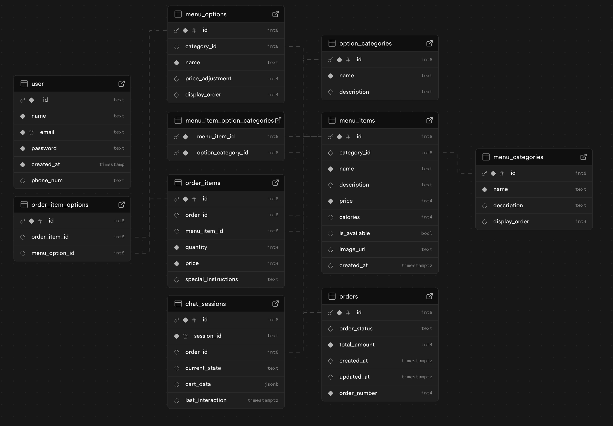
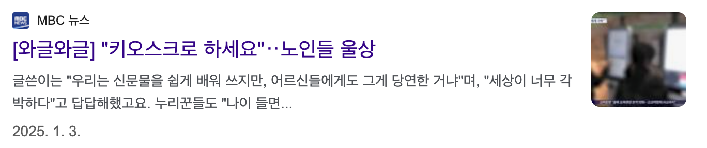

# AI 맥도날드 키오스크

### 1. 토이프로젝트의 목표

1. langchain을 사용해보자.
2. 백엔드 없이 db까지 연동된 앱을 만들어보자.

### 2. 프론트엔드에서 langchain을 사용해보자.

LangChain.js VS LangChain

### 3. 프론트엔드에서 db를 연동해보자.

`Supabase` : Firebase와 비슷하지만 **PostgreSQL 기반의 데이터베이스를 제공**한다.

ERD

### 4. 노인분들도 쉽게 사용하는 키오스크를 만들어 보자.

